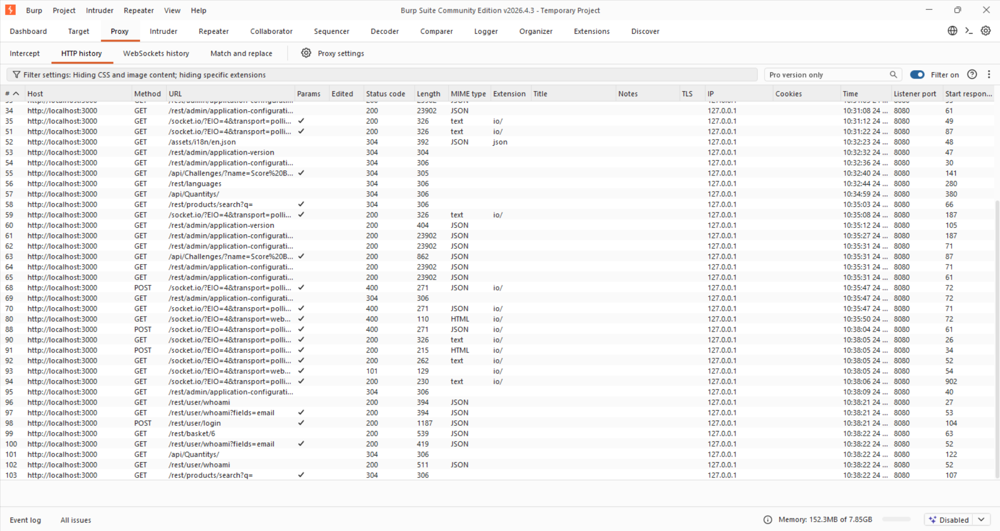
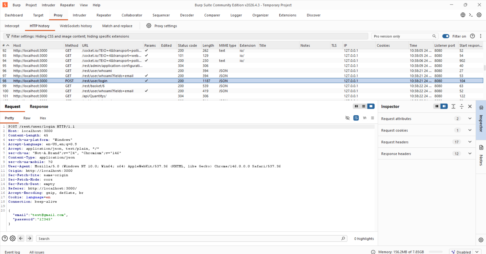
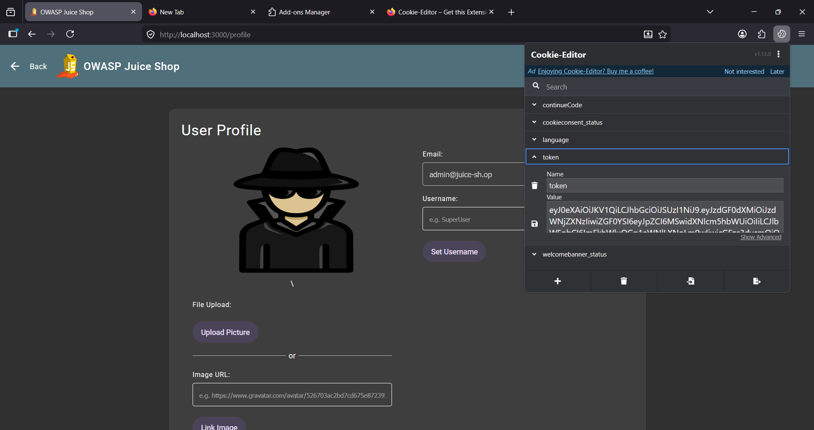

# OWASP Juice Shop — SQL Injection Authentication Bypass

This repository documents a practical implementation of an authentication bypass via SQL Injection (SQLi) targeting the login API endpoint of the **OWASP Juice Shop** application. By injecting a malformed payload into the JSON request body, the backend database validation logic was manipulated to grant administrative access without requiring valid credentials.

---

## 📊 Technical Overview

* **Target Application:** OWASP Juice Shop (vulnerabilities-by-design training platform)
* **Vulnerable Endpoint:** `POST /rest/user/login`
* **Vulnerability Type:** SQL Injection (Authentication Bypass / Improper Input Validation)
* **Tools Used:** Burp Suite Community Edition, Cookie-Editor Extension, Mozilla Firefox
* **Impact:** Critical (Complete administrative account takeover and session hijacking)

---

## 🛠️ Complete Attack Walkthrough

### 1. Traffic Interception & Reconnaissance
The web browser traffic was proxied through Burp Suite to analyze the authentication mechanisms of the application. By capturing the traffic under the **HTTP history** sub-tab of the **Proxy** tool, the target login routine was isolated.



The application transmits credentials using an API design structure rather than traditional URL-encoded forms. The target parameters and URI context are detailed below:
* **Target URI:** `http://localhost:3000/rest/user/login`
* **HTTP Method:** `POST`
* **Payload Format:** `application/json`

By inspecting the raw request, the structure of the JSON keys (`email` and `password`) sent to the backend database was mapped out.



---

### 2. Crafting and Executing the SQL Injection Payload
The intercepted login request was forwarded to Burp Suite **Repeater** to allow for iterative manipulation of the payload inputs. 

To exploit improper input sanitization in the database query handling, the `email` field string value was modified into a classic tautology injection sequence (`' OR 1=1 --`), while the password field was supplied with an arbitrary value (`x`).



#### 🔍 Underlying Vulnerability Mechanics
The backend application code handles input processing unsafely, likely constructing raw database syntax strings dynamically like this:

```sql
SELECT * FROM Users WHERE email = '$USER_INPUT' AND password = '$PASSWORD_INPUT';
