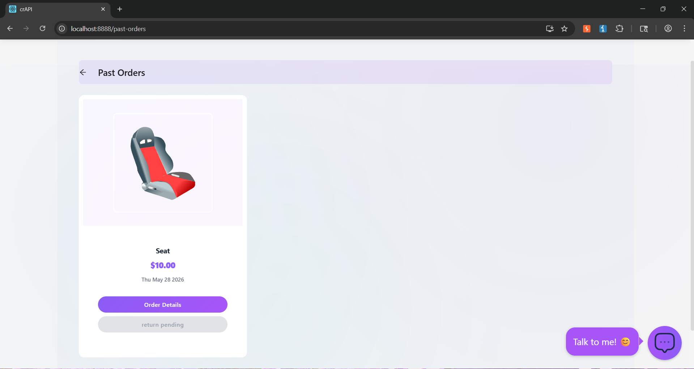
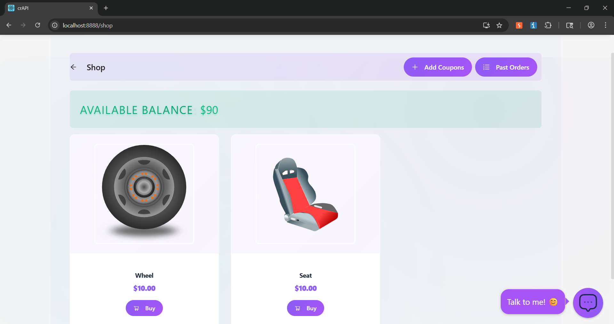
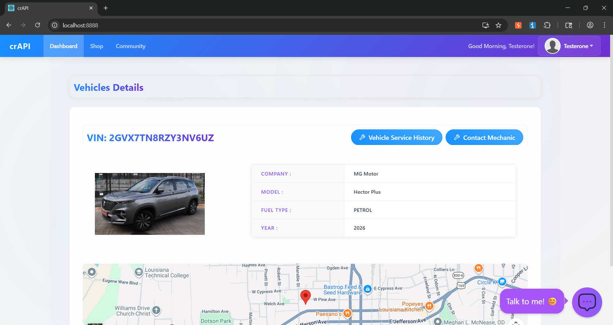
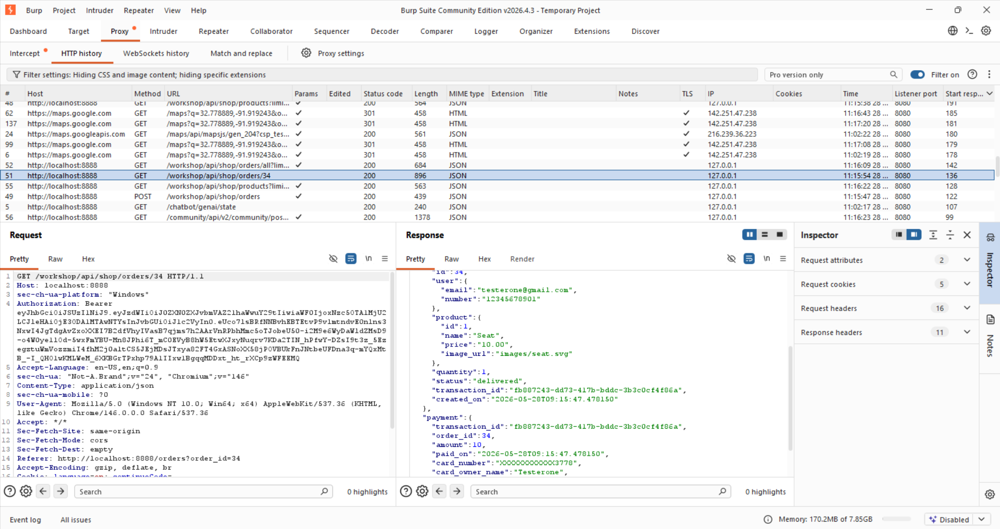
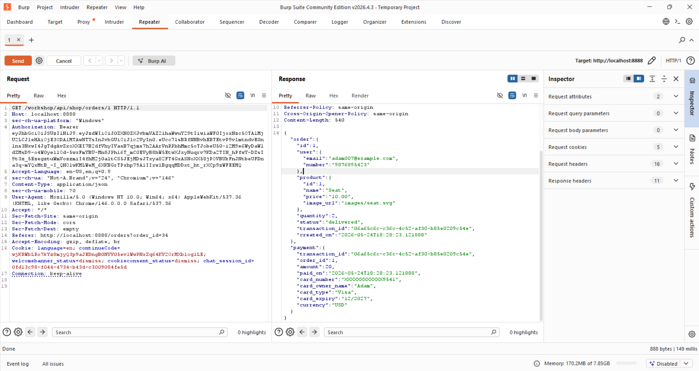

# 🔓 API7:2023 — Excessive Data Exposure
### crAPI Penetration Testing | OWASP API Security Top 10

---

> **Vulnerability:** The API returns more data than the client needs, exposing sensitive fields that are not displayed in the UI but are accessible in raw API responses.

---

## 📋 Table of Contents

- [Overview](#overview)
- [Environment](#environment)
- [Attack Methodology](#attack-methodology)
- [Step-by-Step Walkthrough](#step-by-step-walkthrough)
- [Impact](#impact)
- [Remediation](#remediation)
- [References](#references)

---

## Overview

**Excessive Data Exposure** occurs when an API endpoint returns a full data object, relying on the client-side to filter what is shown to the user. An attacker who intercepts or directly queries the API receives all fields — including sensitive ones never meant to be exposed.

In this test against **crAPI (Completely Ridiculous API)**, we identified endpoints that return over-privileged responses containing PII, internal identifiers, and other sensitive data beyond what the application UI displays.

| Detail | Value |
|---|---|
| **OWASP Category** | API3:2019 / API3:2023 — Excessive Data Exposure |
| **Target Application** | crAPI (Completely Ridiculous API) |
| **Severity** | 🔴 High |
| **Authentication Required** | Yes (standard user) |
| **Tools Used** | Burp Suite, Browser DevTools |

---

## Environment

crAPI is a deliberately vulnerable API application designed to simulate real-world API security flaws. It exposes a vehicle management and community forum platform backed by REST APIs.

---

## Attack Methodology

```
Reconnaissance → Product Analysis → Purchase Trigger → API Interception → Data Extraction
```

The core approach:
1. Interact with the application as a normal authenticated user
2. Intercept and inspect raw API responses (not just what the UI renders)
3. Identify fields returned by the server that are not shown in the frontend
4. Assess the sensitivity of the exposed data

---

## Step-by-Step Walkthrough

### Step 1 — Product Analysis

Browse the crAPI shop as an authenticated user and identify available products. The UI displays a product name, image, and price — but the underlying API response contains significantly more.



---

### Step 2 — Product Purchase

Initiate a purchase to trigger API calls that can be intercepted and inspected. The purchase flow invokes several backend endpoints that return rich JSON objects.



---

### Step 3 — Information Gathering

Using Burp Suite or browser developer tools, capture the raw HTTP responses from the API. At this stage we examine the full JSON payload returned — not just what the UI renders.



---

### Step 4 — API Endpoint Data Gathering

Query the API endpoints directly (e.g., `/community/api/v2/community/posts/recent` or `/workshop/api/shop/products`) and observe the complete response structure. Fields such as internal IDs, user emails, vehicle VINs, and other PII are present in the raw response even though they are never displayed in the application.



---

### Step 5 — Data Exposure Confirmation

The raw API response confirms excessive data exposure. Sensitive fields are returned to any authenticated user who queries the endpoint directly, bypassing the UI filtering layer entirely.



---

## Impact

| Impact Area | Description |
|---|---|
| **Privacy Breach** | PII (names, emails, phone numbers) exposed to any authenticated user |
| **Enumeration Risk** | Internal object IDs can be harvested for further attacks (BOLA/IDOR) |
| **Data Harvesting** | Automated scraping of sensitive records across all users |
| **Compliance Violation** | Potential GDPR / POPIA / HIPAA violations depending on data type |
| **Reputational Damage** | Loss of user trust if a breach is disclosed |

---

## Remediation

### ✅ Recommended Fixes

**1. Implement Response Filtering at the API Layer**
Never rely on the client to filter sensitive fields. Use a DTO (Data Transfer Object) or response schema that explicitly defines which fields are returned.

```json
// ❌ BAD — Full object returned
{
  "id": "a3f9...",
  "email": "user@example.com",
  "name": "John Doe",
  "internal_score": 99,
  "vehicle_vin": "1HGCM82633A123456",
  "credit_card_last4": "4242"
}

// ✅ GOOD — Only necessary fields returned
{
  "name": "John Doe",
  "membership_level": "Gold"
}
```

**2. Apply the Principle of Least Privilege to API Responses**
Each endpoint should return only the minimum data required for the specific use case.

**3. Use an API Gateway with Schema Validation**
Enforce response schemas at the gateway level to prevent accidental over-exposure even if upstream services return more data.

**4. Conduct Regular API Response Audits**
Map every endpoint to its intended consumer and validate that no extra fields are being returned.

**5. Implement Data Classification**
Tag fields as `PUBLIC`, `INTERNAL`, or `SENSITIVE` and enforce that sensitive fields are never serialised in external-facing responses.

---

## References

- [OWASP API Security Top 10 — API3:2023 Excessive Data Exposure](https://owasp.org/API-Security/editions/2023/en/0xa3-broken-object-property-level-authorization/)
- [crAPI GitHub Repository](https://github.com/OWASP/crAPI)
- [OWASP API Security Project](https://owasp.org/www-project-api-security/)
- [PortSwigger — API Testing](https://portswigger.net/web-security/api-testing)

---

<div align="center">

*Penetration test conducted against a deliberately vulnerable application (crAPI) in a controlled lab environment. Do not attempt against systems without explicit written authorisation.*

</div>
